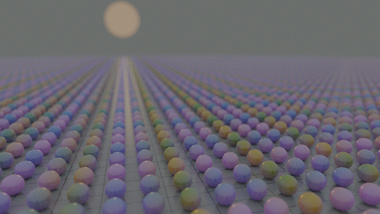
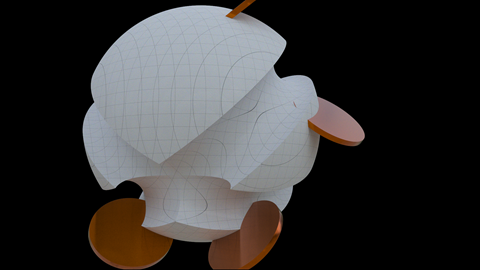
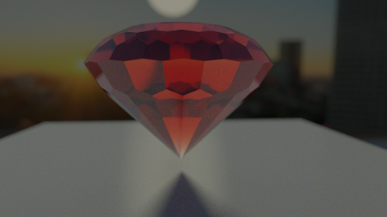
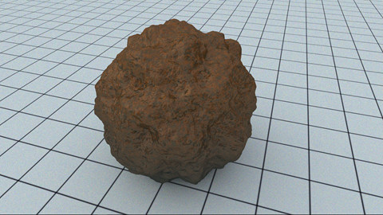
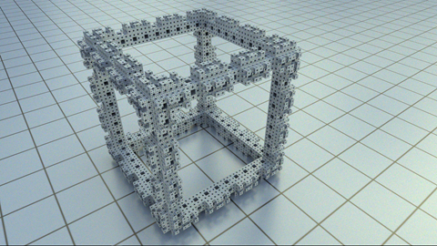
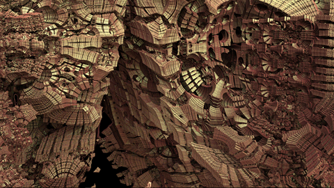
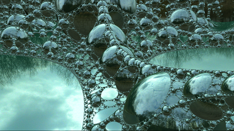
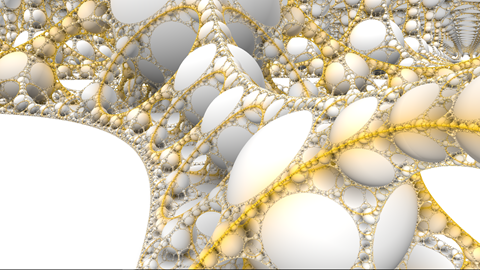
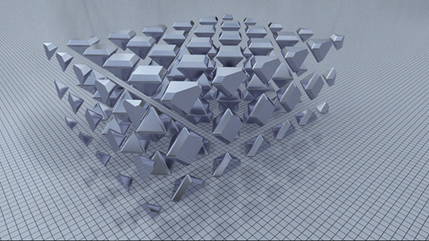
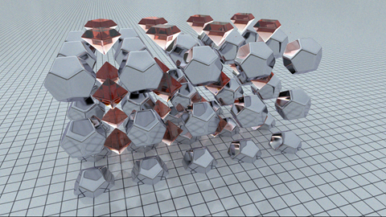

# Snelly

Snelly is a system for physically-based SDF (signed distance field) pathtracing in a web browser. 

<a href="https://cdn.rawgit.com/portsmouth/snelly/master/exampleScenes/helloWorld.html"></a><a href="https://cdn.rawgit.com/portsmouth/snelly/master/exampleScenes/basicAnimation.html"></a><a href="https://cdn.rawgit.com/portsmouth/snelly/master/exampleScenes/gem.html"></a><a href="https://cdn.rawgit.com/portsmouth/snelly/master/exampleScenes/meteorite.html"></a>

<a href="https://cdn.rawgit.com/portsmouth/snelly/master/exampleScenes/rock.html"></a><a href="https://cdn.rawgit.com/portsmouth/snelly/master/exampleScenes/menger.html"></a><a href="https://cdn.rawgit.com/portsmouth/snelly/master/exampleScenes/mandelbox.html"></a><a href="https://cdn.rawgit.com/portsmouth/snelly/master/exampleScenes/apollonian_pt.html"></a>

<a href="https://cdn.rawgit.com/portsmouth/snelly/master/exampleScenes/apollonian_firsthit.html"></a><a href="https://cdn.rawgit.com/portsmouth/snelly/master/exampleScenes/lattice_metallic.html"></a><a href="https://cdn.rawgit.com/portsmouth/snelly/master/exampleScenes/lattice_dielectric.html"></a><a href="https://cdn.rawgit.com/portsmouth/snelly/master/exampleScenes/lattice_mixed.html"></a>

UI controls:
 - left mouse to rotate, alt-mouse to pan
 - AWSD to fly
 - F to frame camera on initial position and orientation
 - R to reset scene to initial state
 - O to serialize scene code to Javascript console
 - H to hide/show the sidebar UI
 - F11 to enter/exit fullscreen mode
 - spacebar to pause/play animated scenes
    

## HTML structure   

A Snelly scene is defined by a single, standalone HTML file, which has the following overall structure:
```html
<body onload="onLoad();">
<script type="text/javascript" src="../js/compiled/snelly.min.js"></script>
<script type="text/javascript">

function Scene() {}
Scene.prototype.shader = function() 
{ 
  /* GLSL code */ 
  return `
    uniform float foo; 
    float SDF_SURFACE(vec3 X)    { /* <code omitted> */ }
    float SDF_METAL(vec3 X)      { /* <code omitted> */ }
    float SDF_DIELECTRIC(vec3 X) { /* <code omitted> */ }
    vec3 SURFACE_DIFFUSE_REFLECTANCE(in vec3 X) { /* <code omitted> */ }
    // etc.
  `; 
}

Scene.prototype.init = function(snelly) 
{ 
  /* initial scene setup */
  let renderer  = snelly.getRenderer();
  let camera    = snelly.getCamera();
  let controls  = snelly.getControls();
  let materials = snelly.getMaterials();
  
  camera.position.set(6.0, 3.0, -6.0);
  controls.target.set(0.0, 0.0, 0.0);
  renderer.maxBounces = 9;
  materials.loadMetal('Copper');
  materials.loadDielectric('Diamond');
  // etc..
}

Scene.prototype.getMinScale = function() { return 1.0e-4; /* raymarch tolerance */ }
Scene.prototype.getMaxScale = function() { return 1.0e2; /* raymarch infinity */ }
Scene.prototype.envMap = function()  { return '<env map url>'; }
Scene.prototype.initGui = function(gui) { /* setup GUI */  }
Scene.prototype.syncShader = function(shader) { /* sync shader with GUI */ }
Scene.prototype.preframeCallback = function(snelly, gl) { /* custom logic */ }
Scene.prototype.postframeCallback = function(snelly, gl) { /* custom logic */ }

function onLoad() { snelly = new Snelly(new Scene()); animateLoop(); }
function animateLoop() { snelly.render(); window.requestAnimationFrame(animateLoop); }

</script>
</body>
```
The only mandatory function to implement in Scene is <a href="docs/API.md/#Scene+shader">Scene.shader</a>, the others are all optional. However the <a href="docs/API.md/#Scene+init">Scene.init</a>
function is almost always needed, to set the initial camera orientation at least.

## Scene description

A Snelly scene consists of 3d objects defined by a mathematical signed distance function (SDF) written in GLSL code, i.e. where this function is zero corresponds to the surface of the object, and where it is negative is the interior. In each scene there can (currently) only exist three such objects: a <a href="docs/API.md/#Metal">Metal</a>, a <a href="docs/API.md/#Dielectric">Dielectric</a>, and a plastic-like <a href="docs/API.md/#Surface">Surface</a> ("uber" material). These three materials can freely intersect and embed one another.

The rendered scene geometry is defined by specifying, via the <a href="docs/API.md/#Scene+shader">Scene.shader</a> call, three GLSL functions:
```glsl
// the SDF of the uber-surface material
float SDF_SURFACE(vec3 X);

// the SDF of the (selected) physical metal material
float SDF_METAL(vec3 X);

// the SDF of the (selected) physical dielectric material
float SDF_DIELECTRIC(vec3 X);
```

Arbitrary spatial dependence of the materials can be optionally specified via GLSL functions (given the surface hit point X, normal N, and view direction V):
```glsl
    // return surface diffuse reflectance (defaults to just return the input UI constant C)
    vec3 SURFACE_DIFFUSE_REFLECTANCE(in vec3 C, in vec3 X, in vec3 N, in vec3 V);

    // return surface specular reflectance (defaults to just return the input UI constant C)
    vec3 SURFACE_SPECULAR_REFLECTANCE(in vec3 C, in vec3 X, in vec3 N, in vec3 V);

    // return surface roughness in [0,1] (defaults to just return the input roughness)
    float SURFACE_ROUGHNESS(in float roughness, in vec3 X, in vec3 N);

    // return metal roughness in [0,1] (defaults to just return the input UI constant roughness)
    float METAL_ROUGHNESS(in float roughness, in vec3 X, in vec3 N);

    // return metal specular reflectance (defaults to just return the input C)
    vec3 METAL_SPECULAR_REFLECTANCE(in vec3 C, in vec3 X, in vec3 N, in vec3 V);

    // return dielectric roughness in [0,1] (defaults to just return the input UI constant roughness)
    float DIELECTRIC_ROUGHNESS(in float roughness, in vec3 X, in vec3 N);

    // return dielectric specular reflectance (defaults to just return the input UI constant C)
    vec3 DIELECTRIC_SPECULAR_REFLECTANCE(in vec3 C, in vec3 X, in vec3 N, in vec3 V);
```

A simple, configurable interactive UI for the scene and renderer state is provided via [dat.GUI](https://workshop.chromeexperiments.com/examples/gui/#1--Basic-Usage). Basic control over the scene contents or animation can be coded by adding uniform variables in the SDF functions, and setting them to the corresponding UI values in the <a href="docs/API.md/#Scene+syncShader">Scene.syncShader</a> function.

The details of the properties of the three material types can then be specified in <a href="docs/API.md/#Scene+init">Scene.init</a> via the <a href="docs/API.md/#Materials">Materials</a> object. Additional spatial dependence of the material surface properties can be introduced by providing modulating GLSL functions.

Procedural camera motion and scene animation can be authored (programmatically) via the pre- and post-frame callbacks. 

As a standalone web page, a Snelly scene can be easily shared, for example by keeping the HTML file in a GitHub repository and simply linking to the file via [RawGit](https://rawgit.com/). 

## Rendering

The renderer is currently a uni-directional pathtracer, with physically correct dispersion for dielectrics and metals. The refractive index data was derived from a combination of tabulated data and analytic models, obtained from refractiveindex.info.
(Basic ambient occlusion and normals rendering modes are also provided).

For simplicity, for now the only lighting in the scene is a (non-HDRI) environment map. This can be specified via a URL to a lat-long map, via the <a href="docs/API.md/#Scene+envMap">Scene.envMap</a> call:
```javascript
    Scene.prototype.envMap = function()
    {
        return 'https://cdn.rawgit.com/portsmouth/envmaps/74e9d389/HDR_040_Field_Bg.jpg';
    }
```

Other such env-maps are available from [here](https://github.com/portsmouth/envmaps) (convert to RawGit links first).

Or if an env-map image is not supplied, then the lighting is taken to be a constant intensity sky. In both cases, the sky spectrum is modulated by a blackbody emission spectrum with adjustable temperature (via the property <a href="docs/API.md/#Renderer">Renderer.skyTemperature</a>).

## Saving scene state

Often we want to explore and fine-tune a scene by moving the camera around, tweaking the scene parameters and materials, and adjusting renderer settings. This work would be wasted without a way to save the resulting scene state.
A mechanism for this is provided by pressing the 'O' key to dump to the console a Javascript code which can then be inserted into the <a href="docs/API.md/#Scene+init">Scene.init</a> function, to replicate the entire scene state. An example of this output is:
```javascript
/******* copy-pasted console output on 'O', begin *******/

let renderer  = snelly.getRenderer();
let camera    = snelly.getCamera();
let controls  = snelly.getControls();
let materials = snelly.getMaterials();
    
snelly.showGUI(true);

/** Camera settings:
*       camera is a THREE.PerspectiveCamera object
*       controls is a THREE.OrbitControls object
*/
camera.fov = 45;
camera.up.set(0, 1, 0);
camera.position.set(10.32444633217751, -0.5153825294569127, -6.7722559545030085);
controls.target.set(-0.5561757324087446, -0.6317558415254627, -1.159897890031697);
controls.zoomSpeed = 2;
controls.keyPanSpeed = 100;

/** Renderer settings **/
renderer.renderMode = 'pt';  // The other modes are: 'ao', 'normals'
renderer.maxBounces = 5;
renderer.maxMarchSteps = 256;
renderer.radianceClamp = 3; // (log scale)
renderer.skyPower = 1;
renderer.skyTemperature = 6000;
renderer.exposure = 3;
renderer.gamma = 2.2;
renderer.whitepoint = 2;
renderer.goalFPS = 20;

/** Material settings **/
let surface = materials.loadSurface();
surface.roughness = 0.1;
surface.ior = 1.5;
surface.diffuseAlbedo = [1, 1, 1];
surface.specAlbedo = [1, 1, 1];

let dielectric = materials.loadDielectric('Diamond');
dielectric.absorptionColor = [0.5, 0.5, 0.5];
dielectric.absorptionScale = 100; // mfp in multiples of scene scale
dielectric.roughness = 0.007431448254773935;

let metal = materials.loadMetal('Copper');
metal.roughness = 0.006691306063588591;

/******* copy-pasted console output on 'O', end *******/
```

In order for user-specified scene parameters to be saved this way, it is necessary to implement a function to output the appropriate regeneration code. For example if the scene init code defines parameters
```javascript
    this.parameters = {};
    this.parameters.foo = 0.63143;
    this.parameters.foo2 = 0.631;
    this.parameters.bar = 0.586;
    this.animFrame = 0;
```

the appropriate generation code would be:
```javascript
/**
* Optionally, provide this function which generates the init code to re-generate 
* the current UI parameter settings. This will be dumped to the console (along with 
* the rest of the UI state) on pressing key 'O', allowing the scene and renderer
* state to be tweaked in the UI then saved by copy-pasting code into the init function below.
*/
Scene.prototype.initGenerator = function()
{
    return `
this.parameters = {};
this.parameters.foo = ${this.parameters.foo};
this.parameters.foo2 = ${this.parameters.foo2};
this.parameters.bar = ${this.parameters.bar};
this.frame = ${this.frame};
    `; 
}
```
With this code in place, the output on pressing 'O' is then a faithful representation of the entire scene state.

## Callbacks and animation

For implementation of custom animation logic we provide pre- and post-frame user callbacks, wherein the user can implement whatever logic he needs to programmatically animate the scene, camera, and materials. See the provided examples for details of how to use this to implement animating scenes, and movie rendering. See:
- [Scene.preframeCallback](docs/API.md/#Scene+preframeCallback)
- [Scene.postframeCallback](docs/API.md/#Scene+postframeCallback)


# API Reference

<dl>
<dt><a href="docs/API.md/#Snelly">Snelly</a></dt>
<dd></dd>
<dt><a href="docs/API.md/#Scene">Scene</a></dt>
<dd></dd>
<dt><a href="docs/API.md/#Renderer">Renderer</a></dt>
<dd></dd>
<dt><a href="docs/API.md/#Material">Material</a></dt>
<dd></dd>
<dt><a href="docs/API.md/#Surface">Surface</a> ⇐ <code><a href="docs/API.md/#Material">Material</a></code></dt>
<dd></dd>
<dt><a href="docs/API.md/#Metal">Metal</a> ⇐ <code><a href="docs/API.md/#Material">Material</a></code></dt>
<dd></dd>
<dt><a href="docs/API.md/#Dielectric">Dielectric</a> ⇐ <code><a href="docs/API.md/#Material">Material</a></code></dt>
<dd></dd>
<dt><a href="docs/API.md/#Materials">Materials</a></dt>
<dd></dd>
</dl>

